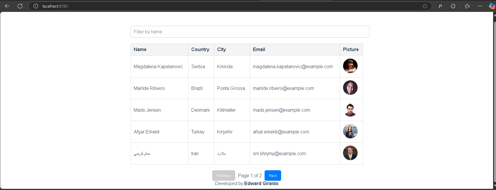
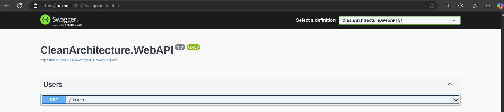
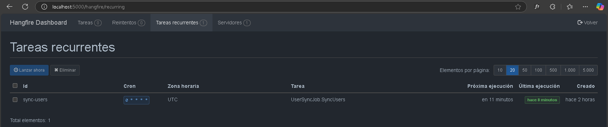
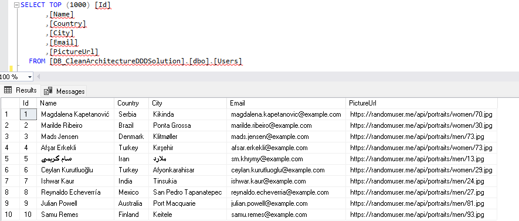
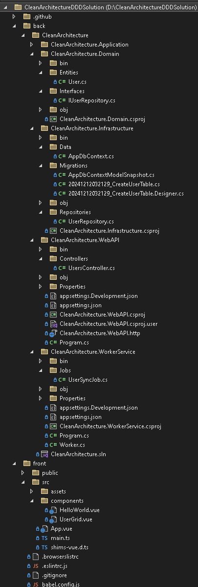

# Clean Architecture DDD Solution with Vue.js Frontend

## Overview

This project implements a **Clean Architecture** combined with the **Domain-Driven Design (DDD)** pattern for the backend, paired with a minimalistic **Vue.js** frontend. The system fetches user data from an external API, stores it in a database, and displays it in a paginated, filterable grid.

---

## Screenshots
### APP Main screen

### Swagger

### Hangfire

### DB

### 5_Project_structure


## Technologies Used

### Backend
- **.NET 6** (C#)
- **Entity Framework Core** (EF Core)
- **SQL Server** (MSSQL)
- **Hangfire** for background jobs
- **RESTful API** (ASP.NET WebAPI)

### Frontend
- **Vue.js 3** with **TypeScript**
- **Axios** for HTTP requests
- **Prettier** for code formatting

---

## Architecture

### Backend
- **Clean Architecture + DDD**
  - **Domain Layer:** Core business logic and entities.
  - **Application Layer:** Interfaces and application services.
  - **Infrastructure Layer:** Data access using EF Core and repository pattern.
  - **WebAPI:** RESTful services exposing data to clients.
  - **Worker Service:** A background service using Hangfire for scheduled tasks (e.g., fetching data from the external API).

### Frontend
- **Component-Based Design:** Vue.js components with scoped CSS.
- **Responsive UI:** Table grid styled for desktop and mobile.
- **Client-Side Pagination:** Paginated table displaying 5 records per page.

---

## Setup and Configuration

### Prerequisites
- **Backend:** Visual Studio 2022 or later
- **Frontend:** Node.js (v14+), Vue CLI
- **Database:** SQL Server

---

### Backend Configuration

1. **Clone the Repository**
   ```bash
   git clone <repository-url>
   cd back/CleanArchitecture
   ```

2. **Setup the Database**
   - Update the connection string in `Program.cs` of `CleanArchitecture.WebAPI` and `CleanArchitecture.WorkerService`:
     ```csharp
     options.UseSqlServer("data source=PC\\SQLEXPRESS; initial catalog=DB_CleanArchitectureDDDSolution; MultipleActiveResultSets=true; TrustServerCertificate=True; Integrated Security=True");
     ```

   - Run the following commands to apply migrations:
     ```bash
     dotnet ef migrations add InitialMigration -p CleanArchitecture.Infrastructure
     dotnet ef database update -p CleanArchitecture.Infrastructure
     ```

3. **Run the Backend**
   - Open the solution in Visual Studio.
   - Set **CleanArchitecture.WebAPI** and **CleanArchitecture.WorkerService** as startup projects.
   - Start the project (`Ctrl + F5`).

---

### Frontend Configuration

1. **Navigate to the Frontend Directory**
   ```bash
   cd front
   ```

2. **Install Dependencies**
   ```bash
   npm install
   ```

3. **Run the Development Server**
   ```bash
   npm run serve
   ```

4. **Access the Frontend**
   - Open your browser and navigate to `http://localhost:8080`.

---

## How It Works

1. **Data Fetching and Storage:**
   - The `WorkerService` fetches user data every hour from the [RandomUser API](https://randomuser.me/api).
   - Data is stored in the SQL Server database using EF Core.

2. **API Exposure:**
   - The WebAPI serves the stored data via a REST endpoint (`GET /Users`).

3. **Frontend Display:**
   - The Vue.js app retrieves data from the backend and displays it in a filterable, paginated table.

---

